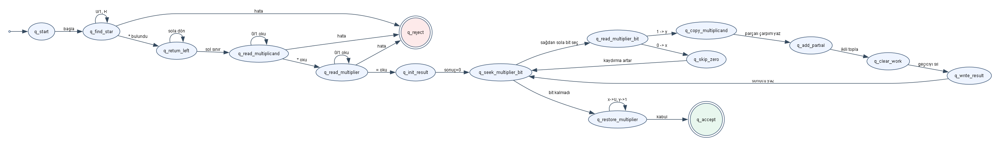

# Tek Bantlı Turing Makinesi ile Binary Çarpma Hesaplayıcı

| Bilgi | Açıklama |
|---|---|
| Ders | Özdevinirler Kuramı |
| Ödev | Final Ödev 1 |
| Proje Adı | Tek Bantlı Turing Makinesi ile İkili Sayı Çarpma Makinesi |
| Öğrenci | Yasin Engin |
| Öğrenci No | 23060510 |
| Kullanılan Dil | Python |
| Teslim İçeriği | Kaynak kod, geçiş tablosu, durum diyagramı, test örnekleri ve proje raporu |
| GitHub Linki | https://github.com/YasinEnginn/binary-multiplication-turing-machine |
| YouTube Video Linki | https://youtu.be/dtmzvePSpGo |

> Teslim edilecek PDF dosya adı `23060510_proje1_rapor.pdf` biçiminde
> hazırlanmıştır.

## Özet

Bu çalışmada, iki binary sayıyı çarpmak üzere tek bantlı bir Turing Makinesi
simülatörü geliştirilmiştir. Program kullanıcıdan iki adet binary sayı alır,
girdiyi `birinci*ikinci=` biçiminde banda yerleştirir, `*` ve `=` sembolleri
yardımıyla operandları ayrıştırır ve sonucu `=` sembolünden sonraki alana yazar.

Çarpma işlemi, bilgisayar mimarisinde de temel bir yaklaşım olan `kaydır ve
topla` yöntemiyle modellenmiştir. Multiplier bitleri sağdan sola işlenir; bit
`1` olduğunda multiplicand ilgili basamak kadar sola kaydırılarak mevcut sonuca
eklenir, bit `0` olduğunda ise yalnızca kaydırma adımı ilerletilir. Program her
adımda mevcut durumu, okunan sembolü, yazılan sembolü, kafa hareketini, sonraki
durumu ve bant içeriğini raporlar.

## 1. Problem Tanımı

Ödevin amacı, binary sayı sistemi üzerinde çarpma işlemini Turing Makinesi
seviyesinde modellemektir. Geliştirilen program şu temel gereksinimleri
karşılar:

- kullanıcıdan iki binary sayı alınması
- girdilerin yalnızca `0` ve `1` sembollerinden oluştuğunun doğrulanması
- bant formatının `multiplicand*multiplier=` olarak oluşturulması
- `*` sembolü ile operandların açık biçimde ayrıştırılması
- `=` sembolünden sonra sonuç alanının kullanılması
- çarpmanın `shift & add` yaklaşımıyla gerçekleştirilmesi
- her makine adımının izlenebilir biçimde çıktı olarak verilmesi
- sonucun hem binary hem de decimal karşılığıyla gösterilmesi

Ödevde verilen örnek:

```text
Girdi bandı : 11*10=
Sonuç       : 110
Final bant  : 11*10=110
```

Bu sonuç doğrudur; çünkü `11₂ = 3`, `10₂ = 2` ve `3 x 2 = 6 = 110₂`.

## 2. Turing Makinesi Modeli

Simülatör tek bant ve tek okuma-yazma kafası kullanır. Bant, sınırsız kabul
edilen seyrek bir yapı olarak modellenmiştir; kullanılmayan hücreler `_` boş
sembolüyle temsil edilir.

| Bileşen | Tanım |
|---|---|
| Durum kümesi | `q_start`, `q_find_star`, `q_return_left`, `q_read_multiplicand`, `q_read_multiplier`, `q_init_result`, `q_seek_multiplier_bit`, `q_read_multiplier_bit`, `q_skip_zero`, `q_copy_multiplicand`, `q_add_partial`, `q_write_result`, `q_clear_work`, `q_restore_multiplier`, `q_accept`, `q_reject` |
| Giriş alfabesi | `{0, 1}` |
| Bant alfabesi | `{0, 1, *, =, #, x, y, _}` |
| Başlangıç durumu | `q_start` |
| Kabul durumu | `q_accept` |
| Red durumu | `q_reject` |
| Boş sembol | `_` |
| Kafa hareketleri | `L` sola, `R` sağa, `S` aynı hücrede kal |

Geçiş tablosu [docs/gecis_tablosu.md](docs/gecis_tablosu.md) dosyasında,
durum geçiş diyagramı ise [docs/durum_diyagrami.png](docs/durum_diyagrami.png)
dosyasında sunulmuştur.



## 3. Binary Sayı Sistemi

Binary sayı sisteminde her basamak 2'nin kuvvetlerini temsil eder. En sağdaki
basamak `2⁰`, onun solundaki basamak `2¹`, sonraki basamak ise `2²` değerine
sahiptir.

Örnek:

```text
101₂ = 1*2² + 0*2¹ + 1*2⁰ = 5
11₂  = 1*2¹ + 1*2⁰ = 3
```

Bu nedenle `101₂ x 11₂ = 1111₂` olur; decimal karşılığı `5 x 3 = 15`tir.

## 4. Bant Tasarımı ve Operand Ayrıştırma

Operand ayrıştırma, bu ödevin en kritik gereksinimidir. Program operandları
yalnızca kullanıcı girdisindeki sıraya göre varsaymakla kalmaz; bant üzerinde
`*` sembolünü bizzat arar ve sınırları bu sembole göre belirler.

Başlangıç bant biçimi:

```text
multiplicand*multiplier=
```

Örnek:

```text
11*10=
^^ ^^
|  |
|  multiplier
multiplicand
```

Bu gösterimde:

- `*` sembolünün sol tarafı birinci sayı, yani `multiplicand` alanıdır.
- `*` sembolünün sağ tarafı ve `=` sembolünün sol tarafı ikinci sayı, yani
  `multiplier` alanıdır.
- `=` sembolünün sağ tarafı sonuç alanıdır.

Makine `q_find_star` durumunda `*` sembolünü bulur. Daha sonra `q_return_left`
durumuyla sol başa döner, `q_read_multiplicand` durumunda birinci operandı,
`q_read_multiplier` durumunda ise ikinci operandı okur. Multiplier bitleri
işlenirken `0` bitleri geçici olarak `x`, `1` bitleri ise geçici olarak `y`
sembolüyle işaretlenir. İşlem sonunda `q_restore_multiplier` durumu bu
işaretleri tekrar özgün `0` ve `1` sembollerine dönüştürür. Böylece final bant
operandları ve sonucu açık biçimde korur.

## 5. Çarpma Algoritması: Kaydır ve Topla

Makinenin kullandığı çarpma stratejisi `shift & add` yaklaşımıdır. Bu yöntem,
binary çarpmanın her multiplier biti için bir parçalı çarpım üretmesi ilkesine
dayanır.

Algoritma:

1. Sonuç alanı başlangıçta `0` yapılır.
2. Multiplier'ın en sağ bitinden başlanır.
3. Okunan bit `0` ise parçalı çarpım üretilmez; yalnızca shift değeri artırılır.
4. Okunan bit `1` ise multiplicand, mevcut shift değeri kadar sola kaydırılır.
5. Kaydırılmış değer mevcut sonuçla binary toplama kurallarına göre toplanır.
6. Güncellenmiş sonuç `=` sembolünden sonraki alana yeniden yazılır.
7. Tüm multiplier bitleri işlendiğinde makine kabul durumuna geçer.

Ödevde verilen örnek bu mantıkla şu şekilde ilerler:

```text
   11
x  10
-----
   00
  110
-----
  110
```

## 6. Durumların Açıklaması

| Durum | Görev |
|---|---|
| `q_start` | Makinenin başlangıç durumudur. |
| `q_find_star` | Bant üzerinde `*` sembolünü arar ve operand sınırını belirler. |
| `q_return_left` | Multiplicand okuması için bandın sol başına döner. |
| `q_read_multiplicand` | `*` sembolüne kadar birinci operandı okur. |
| `q_read_multiplier` | `=` sembolüne kadar ikinci operandı okur. |
| `q_init_result` | Sonuç alanını `0` ile başlatır. |
| `q_seek_multiplier_bit` | Multiplier bitlerini sağdan sola tarar. |
| `q_read_multiplier_bit` | Sıradaki multiplier bitini okur ve işaretler. |
| `q_skip_zero` | Bit `0` olduğunda toplama yapmadan sonraki adıma geçer. |
| `q_copy_multiplicand` | Bit `1` olduğunda kaydırılmış parçalı çarpımı geçici alana yazar. |
| `q_add_partial` | Geçici parçalı çarpımı mevcut sonuçla toplar. |
| `q_write_result` | Güncellenmiş sonucu sonuç alanına yazar. |
| `q_clear_work` | Geçici çalışma alanını temizler. |
| `q_restore_multiplier` | `x` ve `y` işaretlerini tekrar `0` ve `1` haline getirir. |
| `q_accept` | Hesaplamanın başarıyla tamamlandığını gösterir. |
| `q_reject` | Geçersiz giriş veya beklenmeyen sembol durumudur. |

## 7. Geçiş Mantığı

Geçiş fonksiyonu, Turing Makinesi'nin her adımda hangi sembolü okuyacağını,
hangi sembolü yazacağını, kafayı hangi yöne hareket ettireceğini ve hangi
duruma geçeceğini tanımlar.

Örnek geçişler:

| Mevcut durum | Okunan | Yazılan | Hareket | Sonraki durum | Anlam |
|---|---|---|---|---|---|
| `q_find_star` | `0/1` | aynı | `R` | `q_find_star` | `*` bulunana kadar sağa ilerlenir. |
| `q_find_star` | `*` | `*` | `L` | `q_return_left` | Operand ayracı bulunur. |
| `q_read_multiplier_bit` | `0` | `x` | `S` | `q_skip_zero` | `0` biti işaretlenir, toplama yapılmaz. |
| `q_read_multiplier_bit` | `1` | `y` | `S` | `q_copy_multiplicand` | `1` biti için parçalı çarpım üretilir. |
| `q_restore_multiplier` | `y` | `1` | `R` | `q_restore_multiplier` | İşaretlenmiş bit eski haline getirilir. |

Tam tablo [docs/gecis_tablosu.md](docs/gecis_tablosu.md) dosyasında verilmiştir.

## 8. Program Çıktıları

Program, hesaplama sürecini adım adım raporlar. Aşağıdaki çıktı, ödevde verilen
`11 x 10` örneğinin özetidir.

```text
Girdi bandi: 11*10=
Operand ayrimi: 11 * 10

Adim adim simulasyon:
Adim 0001 | durum=q_start                  oku=1  yaz=1  hareket=S sonraki=q_find_star              | Baslangic durumundan * arama durumuna gecildi.
           bant: 11*10=
                 ^
Adim 0004 | durum=q_find_star              oku=*  yaz=*  hareket=L sonraki=q_return_left            | * bulundu; operand ayrimi baslatildi.
           bant: 11*10=
                  ^
Adim 0018 | durum=q_read_multiplier_bit    oku=0  yaz=x  hareket=S sonraki=q_skip_zero              | Bit 0 okundu; 0 basamak kaydirma icin toplama yok.
           bant: 11*1x=0
                     ^
Adim 0020 | durum=q_read_multiplier_bit    oku=1  yaz=y  hareket=S sonraki=q_copy_multiplicand      | Bit 1 okundu; 1 basamak kaydirilmis parcali carpim eklenecek.
           bant: 11*yx=0
                    ^

Sonuc:
Binary : 110
Decimal: 6
Final bant: 11*10=110
```

Daha fazla örnek çıktı [docs/ornek_ciktilar.md](docs/ornek_ciktilar.md)
dosyasında yer almaktadır.

## 9. Test Örnekleri

Program farklı girişler üzerinde test edilmiştir. Testler hem doğru sonucu hem
de operand ayraçlarının final bantta korunup korunmadığını denetler.

| No | Birinci sayı | İkinci sayı | Beklenen binary sonuç | Decimal sonuç |
|---:|---|---|---|---:|
| 1 | `11` | `10` | `110` | 6 |
| 2 | `0` | `0` | `0` | 0 |
| 3 | `0` | `1011` | `0` | 0 |
| 4 | `1` | `11101` | `11101` | 29 |
| 5 | `101` | `11` | `1111` | 15 |
| 6 | `1001` | `101` | `101101` | 45 |
| 7 | `111` | `111` | `110001` | 49 |

Test komutu:

```powershell
python -m unittest -v
```

Son çalıştırmada 9 test başarıyla tamamlanmıştır.

## 10. Sonuç ve Değerlendirme

Bu proje, binary çarpma işlemini tek bantlı Turing Makinesi modeliyle
izlenebilir ve doğrulanabilir biçimde gerçekleştirmektedir. Çözümün merkezinde
`*` ve `=` sembolleriyle yapılan açık operand ayrıştırması bulunmaktadır. Bu
ayrıştırma sayesinde makine, `*` sembolünün solundaki değeri multiplicand,
`*` ile `=` arasındaki değeri multiplier, `=` sembolünün sağını ise sonuç alanı
olarak kullanır.

Çarpma işlemi `kaydır ve topla` yaklaşımıyla modellenmiş, her multiplier biti
için gerekli işlem açık durum geçişleriyle temsil edilmiştir. Programın adım
adım çıktı üretmesi, Turing Makinesi'nin soyut hesaplama sürecini gözlemlenebilir
hale getirmektedir. Yapılan testler sonucunda programın farklı binary girişler
için doğru sonuç ürettiği ve final bant formatını koruduğu doğrulanmıştır.
